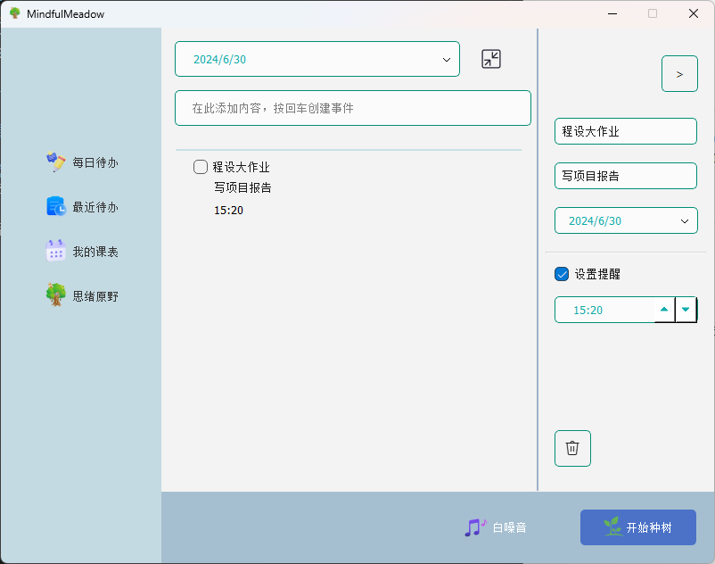
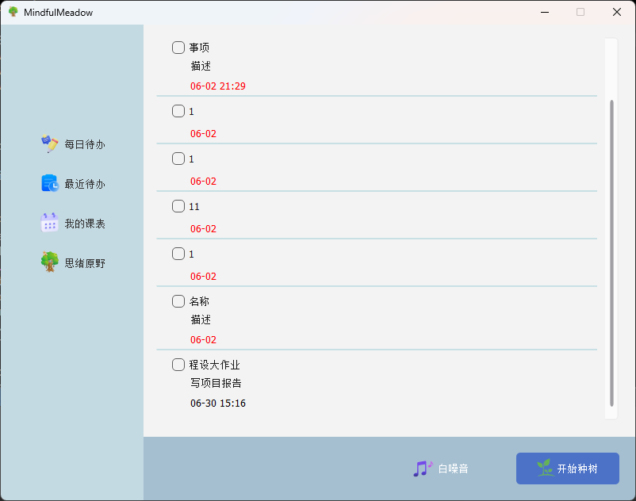
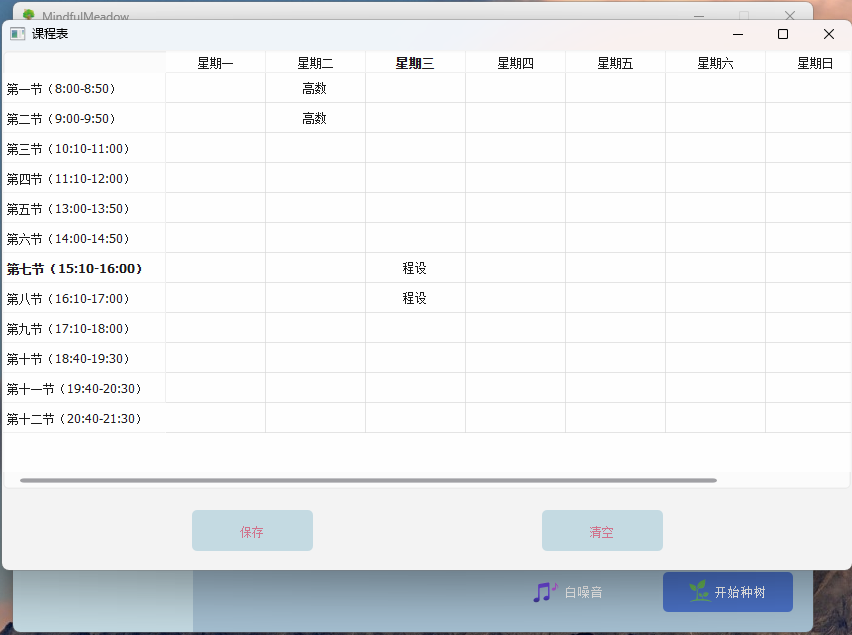
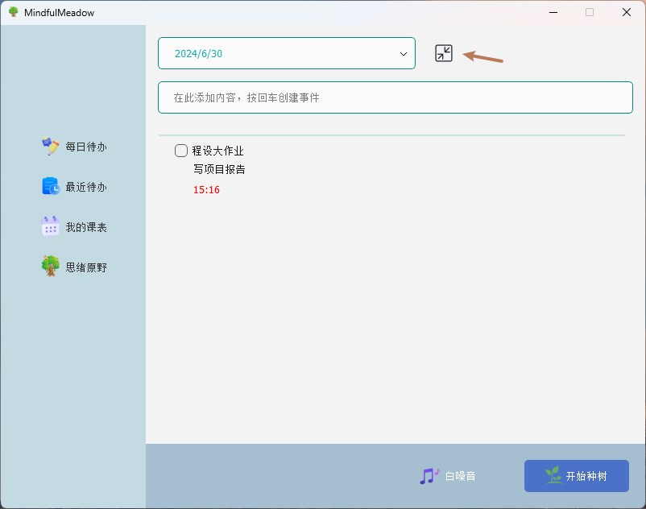
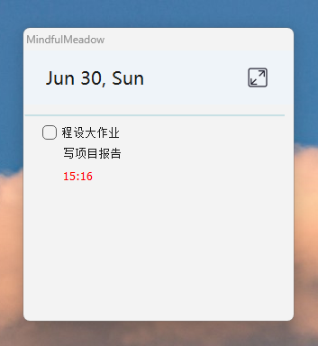
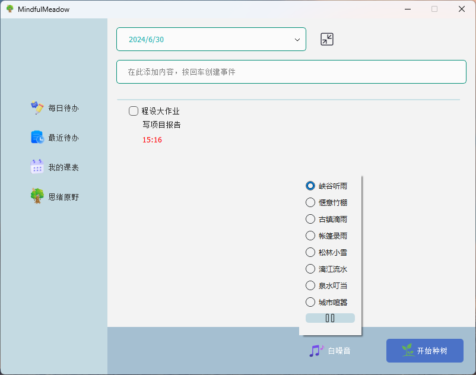
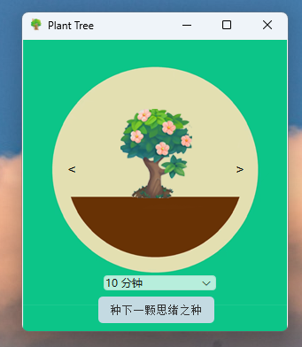
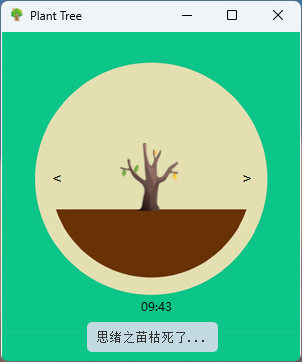
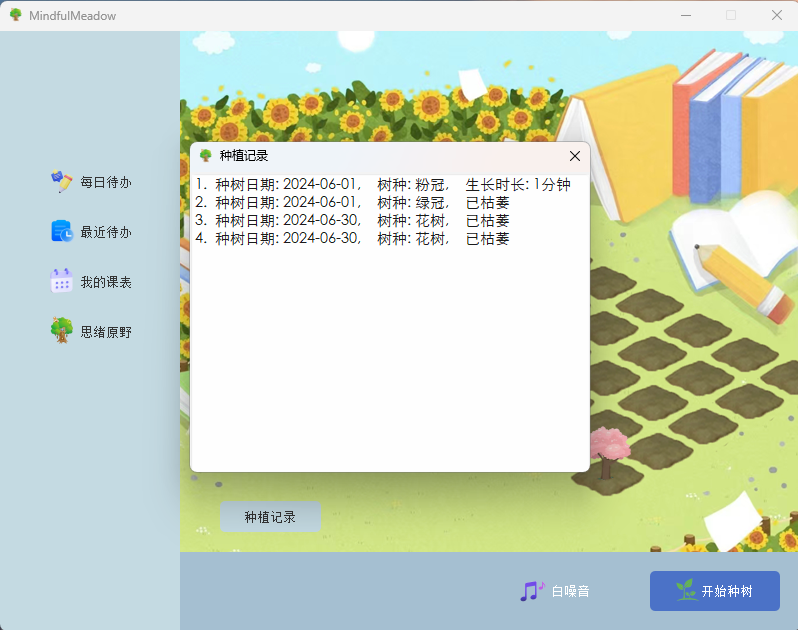

# Mindful Meadow 思绪原野

## 编译环境
Qt 6.7.0 (with Core, Multimedia & Sql) MinGW 64-bit on Windows.  
Other platforms (MacOS & Linux) are not tested.

## 作业报告

### 程序功能介绍

#### 日程管理和提醒
- 根据日期添加日程，可以设置日程名称、描述  
  

- 可以为日程添加提醒，在一天中的指定时间以Windows系统弹窗的形式提醒  
  

- 在“最近待办”中可以显示最近待办以及所有的未完成待办，超时的待办以红色显示  
  

#### 课表功能
- 在“我的课表”中可以现在一周之内的课表，并实现了修改、保存和清空功能  
  

#### 悬浮小窗功能
- 点击主窗口的缩小按钮，可以进入悬浮小窗  
  
- 悬浮小窗总在最前，可以清晰地显示出当天的待办，并且可以相应的点击完成  
  

#### 白噪音功能
- 主窗口的下方有白噪音功能的按钮，可以在我们提供的八种白噪音中选择播放，提高学习效率  
  

#### 种树及专注功能
- 种树功能是模仿移动端专注学习app “Forest”设计的用来提高学习效率的功能，专注学习一定的时长可以种出一棵树，否则树就会枯萎  
- 点击“开始种树”按钮，在弹出的悬浮窗口中可以选择树的种类（我们提供了四种不同类型的树）以及时长（10分钟到3小时不等）  
  
- 点击“种下一棵思绪之树”，伴随着倒计时，树苗会逐渐长一棵大树；如果半途而废，树则会枯死  
  
- 种植的所有树可以在“思绪原野”中显示  
  
- 点击“种植记录”可以显示之前种的树的具体类型以及种植时间，可以用于统计每天专注学习的时长  
  

#### 托盘功能
- 当主窗口被关闭时，整个程序并不会直接关闭，而是会存在于windows托盘区；在托盘里右键可以选择打开主窗口、打开悬浮窗口、播放或暂停白噪声或是彻底退出程序  
  

### 项目各模块与类的设计细节

#### 交互模块（窗口）

##### 主窗口类 `MainWindow`
- 继承自`QWidget`
- 功能：
    - 本项目的最核心的窗口，用于操作大多数的功能
    - 左侧的菜单栏点击切换不同的页面
    - 下侧菜单栏选择播放白噪音以及开始种树
- 实现细节
    - 利用`MatterHandler`类实现事项数据的管理，利用`TreeHandler`类实现树相关数据的管理

##### mini悬浮窗口`MiniSchedule`类
- 继承自`QWidget`
- 功能：
    - 最小化主窗口，置顶显示一个迷你的悬浮窗口
    - 显示当天所有的事项，并可以勾选完成

##### 植树窗口 `plantTree`
- 继承自`QWidget`
- 功能：
    - 通过倒计时种植一棵树，并显示其生长过程
    - 提供UI元素和逻辑以管理树的种植、倒计时和状态更新
- 设计细节：
    - 通过点击左右按钮加减`currentTreeIndex`，通过`QPixmap`存储显示对应索引树种的图片
    - 开始种树后，根据用户选择的时间启动一个`Qtimer`开始倒计时，根据经过时间切换树的阶段图片
    - 可以点击“放弃”取消倒计时，传递信号显示枯树图片
    - 如果强行关闭窗口取消，则传递 倒计时进行中关闭窗口 的相关信号，下次点开种树界面时调整初始化ui函数，使得显示为枯树
    - 种树成功或放弃后，将树的种植日期、树种、枯萎与否、倒计时长，通过与`tree`类、`treehandler`类的交互存到数据库中

##### 思绪原野类 `forest`
- 继承自`QWidget`
- 功能：
    - 在“思绪原野”根据树种与状态显示对应的树的图片，提供种植记录的接口
- 设计细节：
    - 通过调用`TreeHandler`类从数据库中获取树的信息
    - 使用`QLabel`数组显示前 30 棵树的图片或状态
    - 点击种植记录按钮，与`treedetails`类交互，弹出一个种植记录对话框

##### `TreeDetails` 类
- 继承自`QDialog`
- 功能：
    - 显示最近种植的前 30 棵树的种植记录
- 设计细节：
    - 使用`QListWidget`显示每棵树的种植记录
    - 调用`TreeHandler`类来从数据库中获取树的信息，在对话框中实时显示种植记录，包括种植日期、树种、生长状态（生长时长或枯萎状态）

##### 课表 `MySchedule` 类
- 继承自`QWidget`
- 功能：
    - 显示一周的课表，可以进行删改、清除和保存
- 设计细节
    - 使用`QTableWidget`显示课表
    - 使用`QFile`实现课表的保存

#### 数据处理模块

##### 事项处理`MatterHandler`类
- 功能
    - 利用`QSql`库实现事项数据的Sqlite管理
    - 实现增加事项，读取事项和修改事项的功能
- 设计细节
    - 使用`QSql`, `QSqlDatabase`, `QSqlQuery`三个库，在本地创建`matters.db`文件
    - 利用`getMatters`, `addNew`, `updateMatter`三个成员函数实现事项的获取、新增以及更新

##### 树处理`TreeHandler`类
- 功能：类似`MatterHandler`类，实现植树功能相应的数据库管理功能

#### 数据类型模块

##### 事项`Matter`类
- 功能：实现事项的数据结构，保存事项的名称、描述、时间等等属性

##### 树`Tree`类
- 功能：实现树相关的数据结构，保存树的种类、种植时间等等属性

### 小组成员的分工情况
- 主窗口设计与实现：汤平之、曾姜月、石伟业
- 日程管理相关功能与数据库处理：汤平之
- 植树相关功能：曾姜月
- 白噪音相关功能：汤平之
- 课程表相关功能：石伟业
- 迷你窗口相关功能：汤平之
- 绘图与美工设计：曾姜月、汤平之
- 托盘功能实现：汤平之

### 项目的总结与反思
这是我们小组成员第一次使用 Qt 进行项目的设计与实现，总体上来说这个项目最后的呈现效果大致符合我们小组的预期。

在项目选题方面，为了权衡实用性和创新性，我们决定采用 Qt 开发一款日程管理程序。我们希望这个项目，不仅仅作为一个课程大作业，还可以在我们的日常学习生活中得到应用。为了增加程序的特色和功能性，我们参考了广受欢迎的移动端应用 Forest，并融入了专注学习、种树的概念。我们还整合了白噪音、课程表等实用工具，希望能为用户带来更加全面的体验。

在项目开发过程中，我们全程使用 Github 进行代码管理和版本控制。这不仅提升了我们的工作效率，也让我们对协作开发、问题解决等方面有了更深入的认识和理解。通过相互交流、分工合作，我们不仅学会了如何更好地利用 Qt 框架，也增强了作为团队成员的意识和能力。

作为 Qt 编程的新手，我们在使用某些控件和功能时还存在一些理解不足的地方，有时不得不采取相对复杂的编码方式，导致代码冗长。但是我们并没有被这些困难所打击，而是凭借自己的不懈努力，最终实现了预期的所有功能。虽然代码可能不够优雅，但作为初学者能够顺利完成项目，我们已经感到非常满意和自豪了。

通过这次 Qt 项目的实践，我们对 Qt 框架有了更深入的认知和理解，也积累了作为团队进行软件开发的宝贵经验。这无疑会为我们今后的学习和工作带来极大的帮助。我们相信，在未来的学习和实践中，我们一定能够进一步提升自己的编程水平，并以此为基础开发出更加出色的作品。

## 演示视频
https://disk.pku.edu.cn/link/AA2322488AB0E34BA1BE0B91C19011ABD9
文件名：114-演示.mp4
有效期限：2025-01-01 15:05